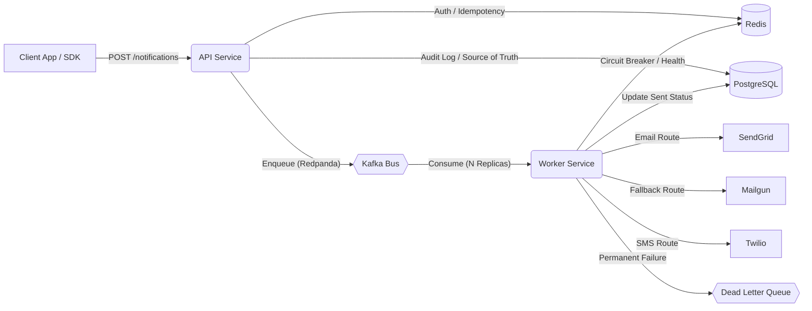

# 🔔 NotifyStack — Scalable Multi-Channel Notification SaaS

[](https://www.npmjs.com/package/@ayush0x44/notifystack)
[](https://opensource.org/licenses/MIT)

**NotifyStack** is a distributed notification engine that simplifies global multi-channel delivery (Email, SMS, Push, In-App). Built for high-availability, it features automatic provider failover, real-time analytics, and a "Zero-Config" SDK.
Scalable Notification System...

🚀 **Dashboard:** [https://notifystack.shop](https://notifystack.shop)  
🔗 **Production API:** `https://api.notifystack.shop`

---

## 🔥 The Problem: Reliable Delivery is Hard
Most applications break when a single notification provider (like SendGrid or Twilio) experiences an outage. NotifyStack solves this with **Infrastructure-as-a-Service** that handles the complexity of delivery so you don't have to.

## 🚀 Key Features

### 🛡️ 1. Intelligent Failover & Circuit Breakers
Our worker engine monitors provider health in real-time. If a primary provider yields a 5xx error or high latency, the **Circuit Breaker** opens, and traffic is instantly shifted to fallback providers (Mailgun/SMTP) without dropping your request.

### 📦 2. "Zero-Config" Node.js SDK
Stop managing multiple API keys and endpoints. The official SDK defaults to our production-ready infrastructure out of the box. Just `npm install @ayush0x44/notifystack`.

### ⚡ 3. High-Throughput Architecture
Built on **Redpanda (Kafka)** and **Redis**, NotifyStack handles spike-heavy traffic by decoupling API ingestion from final delivery, ensuring your main application never slows down.

### 🔔 4. In-App Notification Center
A premium React widget that provides your users with a real-time notification feed. It handles polling, unread counts, and "Mark as Read" logic natively.

---

## 🛠️ Technology Stack

- **Backend:** Node.js (Express), PostgreSQL (Neon.tech)
- **Messaging:** Redpanda Cloud (Production Kafka)
- **Caching & Rate Limiting:** Upstash Redis
- **Frontend:** React, Tailwind CSS, Framer Motion, Shadcn UI
- **Infrastructure:** Render (Web Services & Workers), Vercel (Frontend)
- **Branding:** Custom 3D Asset generation & Premium Design System

---

## 🏗️ Architecture Overview

The system follows a high-availability distributed architecture where the API layer handles ingestion and the Worker layer handles reliable multi-channel delivery.



---

## 📦 SDK Installation

```bash
npm install @ayush0x44/notifystack
```

### Quick Usage
```javascript
const { NotifySDK } = require("@ayush0x44/notifystack");
const sdk = new NotifySDK("ntf_live_xxxx");

await sdk.track("USER_WELCOME", {
  email: "ayush@example.com",
  name: "Ayush"
});
```

---

## 🤝 Contributing
Issues and pull requests are welcome! See the `ARCHITECTURE.md` for internal details.

---

## 📄 License
MIT © **Ayush**
