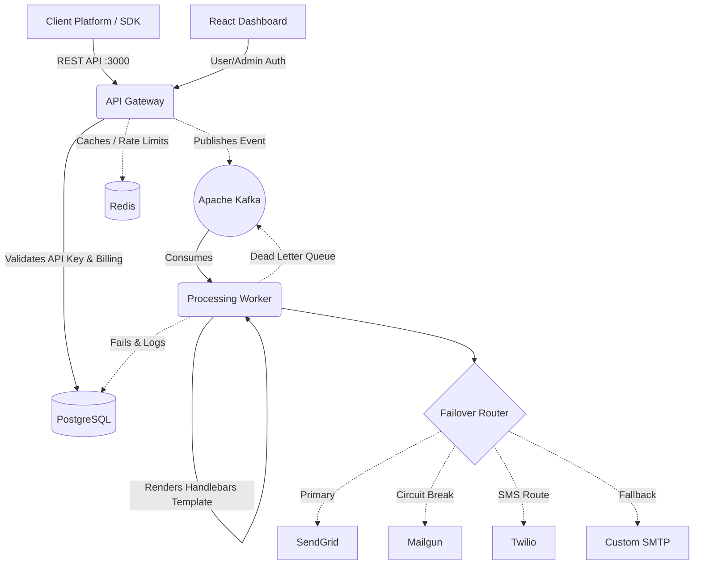

# NotifyStack (Enterprise Notification Infrastructure)

NotifyStack is a highly available, event-driven, multi-channel notification SaaS platform. It acts as a single integration endpoint for all your transactional notifications (Email, SMS) and abstracts away the complexities of routing, provider failover, rendering, and dead-letter queuing.

## 🚀 Features

- **Multi-Channel Delivery:** Send messages via Email (SMTP, SendGrid, Mailgun) and SMS (Twilio).
- **Intelligent Failover:** Built-in circuit breakers. If SendGrid experiences a 5xx timeout, the system automatically redirects the traffic through Mailgun or SMTP without dropping the request.
- **Event-Driven Templates:** Store your handlebars-based templates in the dashboard. Trigger them simply by passing an event name (e.g. `USER_SIGNUP`) and pure JSON data.
- **Resilient Queueing:** Backed by **Apache Kafka** for massive horizontal scalability. Includes a Dead Letter Queue (DLQ) with automatic retry mechanisms for failed dispatches.
- **SaaS Billing Ready:** Fully integrated with Razorpay for automated subscription tier management (Free, Pro, Enterprise).
- **Beautiful Dashboard:** Clean, Framer-Motion powered React dashboard with live analytics, activity logs, API key management, and built-in interactive documentation.
- **Official SDK:** First-class NodeJS `notify-saas-sdk` with full TypeScript definitions.

---

## 🏗️ Architecture



---

## 📂 Project Structure

| Directory | Description |
|-----------|-------------|
| `/api` | The core Express REST API. Handles authentication, subscriptions, API key validation, logging, rate limiting (Redis), and event publishing (Kafka). |
| `/worker` | The background consumer. Evaluates logic, merges JSON into templates, executes circuit breaker rules, and dynamically routes messages to providers. |
| `/dashboard` | The interactive React UI for users to manage event templates, inspect delivery logs in real-time, view analytics, and generate API keys. |
| `/sdk` | The official Node.js wrapper that makes hitting your platform a 1-liner. |

---

## 🛠️ Local Development

### 1. Prerequisites
You will need **Node.js (v18+)**, **PostgreSQL**, **Redis**, and **Kafka / ZooKeeper** running on your local machine.

### 2. Database Setup
```bash
# Connect to PostgreSQL and create the primary database
psql -U postgres
CREATE DATABASE "notify-saas";
```

### 3. Environment Configuration
Duplicate the provided example files across both backend services:
```bash
cp api/.env.example api/.env
cp worker/.env.example worker/.env
```
Ensure you provide a valid `VITE_API_URL` within your `/dashboard/.env` if you are not mapping defaults.

**Testing Environment Note**: To prevent spending real money or burning through limits during development, use **[Mailtrap](https://mailtrap.io)** bounds in `worker/.env` for your SMTP fallback simulation.

### 4. Bootstrapping
Install dependencies and run the stack simultaneously:

```bash
# 1. API Service (Port 3000)
cd api
npm install
npm run dev

# 2. Worker Service
cd worker
npm install
npm run dev

# 3. Dashboard (Port 5173)
cd dashboard
npm install
npm run dev
```

---

## 💻 Usage & Integration

### Sending a message through the REST API

Once you create an account on your locally running dashboard, generate an API key.

```bash
curl -X POST http://localhost:3000/v1/notifications \
  -H "Content-Type: application/json" \
  -H "x-api-key: ntf_live_YOUR_GENERATED_KEY" \
  -H "x-idempotency-key: unique-request-12345" \
  -d '{
    "event": "USER_SIGNUP",
    "data": {
      "email": "customer@example.com",
      "name": "Ayush"
    }
  }'
```

The system will instantly return a `202 Accepted` and offload the actual rendering, failover processing, and delivery logging to the Kafka worker queue!

### Sending using the SDK (Node.js)

```javascript
const NotifySDK = require("notify-saas-sdk");

// Initialize with your API key
const notify = new NotifySDK("ntf_live_YOUR_GENERATED_KEY", {
  baseUrl: "http://localhost:3000"
});

async function run() {
  await notify.track("ORDER_PLACED", {
    email: "buyer@example.com",
    orderId: "#10928",
    total: "$49.99"
  });
}
```

---

## 🛡️ Best Practices & Security
- **Never expose your `.env` variables to git.** (Enforced via `.gitignore`).
- Your Dashboard runs on JWT Bearer tokens, while your Server-to-Server interactions rely on raw Dashboard-generated API Keys. They are hashed using `SHA-256` instantly; the plaintext key is displayed to you ONLY ONE time. Save it safely.
- All requests run through an strict **Idempotency** layer in the API. Provide an `x-idempotency-key` in your headers to guarantee you never double-charge or double-send to a customer on network retries.
